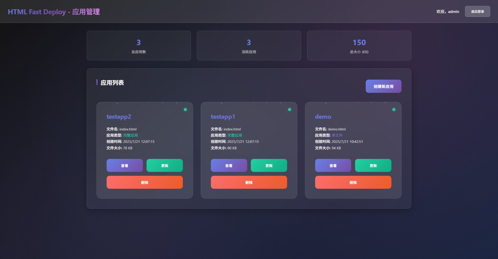

# HTML Fast Deploy

🚀 HTML 快速部署系统 - 基于 FastAPI 的 HTML 应用管理平台



## 项目描述

HTML Fast Deploy 是一个简单高效的 HTML 应用部署和管理系统，基于 FastAPI 构建。它允许用户通过 Web 界面快速上传、管理和部署 HTML 应用。

## 主要功能

### 🔐 用户认证
- 支持多用户登录
- 通过环境变量配置用户账号
- 安全的 Basic Authentication

### 📱 应用管理
- **创建应用**：上传 HTML 文件并指定应用名称
- **查看应用**：直接访问部署的 HTML 应用
- **更新应用**：替换现有应用的 HTML 文件
- **删除应用**：移除不需要的应用

### 🌐 应用访问
- 应用通过 `/apps/{app_name}` 路径访问
- 支持所有现代浏览器
- 响应式设计

## 快速开始

### 1. 安装依赖

```bash
pip install -r requirements.txt
```

### 2. 配置用户账号

创建 `.env` 文件并配置用户账号：

```env
# 用户1
USER_1_NAME=admin
USER_1_PASSWORD=admin123

# 用户2
USER_2_NAME=user1
USER_2_PASSWORD=password123

# 用户3
USER_3_NAME=user2
USER_3_PASSWORD=password456
```

如果不配置环境变量，系统将使用默认账号：
- 用户名：`admin`
- 密码：`admin123`

### 3. 启动服务

```bash
python main.py
```

或者使用 uvicorn：

```bash
uvicorn main:app --host 0.0.0.0 --port 8000 --reload
```

### 4. 访问系统

打开浏览器访问：http://localhost:8000

## 使用说明

### 登录系统
1. 访问 http://localhost:8000
2. 使用配置的用户名和密码登录
3. 登录成功后自动跳转到管理页面

### 创建应用
1. 在管理页面填写应用名称（只能使用英文、数字、下划线和连字符）
2. 选择要上传的 HTML 文件
3. 点击"创建应用"按钮

### 管理应用
- **查看**：点击"查看"按钮在新标签页中打开应用
- **更新**：点击"更新"按钮上传新的 HTML 文件
- **删除**：点击"删除"按钮移除应用

### 访问应用
应用创建后，可以通过以下 URL 访问：
```
http://localhost:8000/apps/{app_name}
```

例如，如果应用名称为 `car-show`，访问地址为：
```
http://localhost:8000/apps/car-show
```

## 项目结构

```
html-fast-deploy/
├── main.py              # 主应用文件
├── requirements.txt     # 依赖包列表
├── setup.py            # 打包配置
├── .env                # 环境变量配置（需要创建）
├── templates/          # HTML 模板
│   ├── login.html      # 登录页面
│   └── admin.html      # 管理页面
├── static/             # 静态文件
└── apps/               # 应用存储目录（自动创建）
    └── *.html          # 上传的 HTML 文件
```

## API 接口

### 认证接口
- `GET /login` - 登录页面
- `POST /login` - 登录验证

### 管理接口
- `GET /admin` - 管理页面
- `POST /admin/apps` - 创建应用
- `DELETE /admin/apps/{app_name}` - 删除应用
- `PUT /admin/apps/{app_name}` - 更新应用

### 应用接口
- `GET /apps/{app_name}` - 访问应用

## 打包为 WHL

### 构建包

```bash
python setup.py bdist_wheel
```

### 安装包

```bash
pip install dist/html_fast_deploy-1.0.0-py3-none-any.whl
```

### 运行

```bash
html-fast-deploy
```

## 环境变量配置

| 变量名 | 说明 | 示例 |
|--------|------|------|
| `USER_1_NAME` | 第一个用户名 | admin |
| `USER_1_PASSWORD` | 第一个用户密码 | admin123 |
| `USER_2_NAME` | 第二个用户名 | user1 |
| `USER_2_PASSWORD` | 第二个用户密码 | password123 |

## 技术栈

- **后端框架**：FastAPI
- **模板引擎**：Jinja2
- **认证方式**：HTTP Basic Authentication
- **文件处理**：aiofiles
- **环境配置**：python-dotenv

## 开发说明

### 应用名称规则
- 只能使用英文、数字、下划线和连字符
- 不支持中文和特殊字符
- 建议使用有意义的名称，如：`car-show`、`dashboard`、`portfolio`

### 文件存储
- HTML 文件存储在 `apps/` 目录下
- 文件名格式：`{app_name}.html`
- 支持任意大小的 HTML 文件

### 安全考虑
- 使用 Basic Authentication 进行身份验证
- 验证应用名称格式，防止路径遍历攻击
- 只允许上传 HTML 文件

## 许可证

MIT License

## 贡献

欢迎提交 Issue 和 Pull Request！

## 更新日志

### v1.0.0
- 初始版本发布
- 支持基本的应用管理功能
- 实现用户认证系统
- 提供现代化的 Web 界面